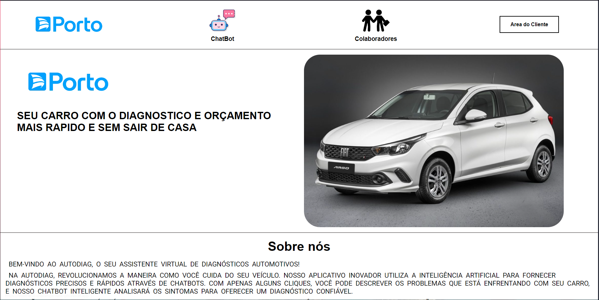
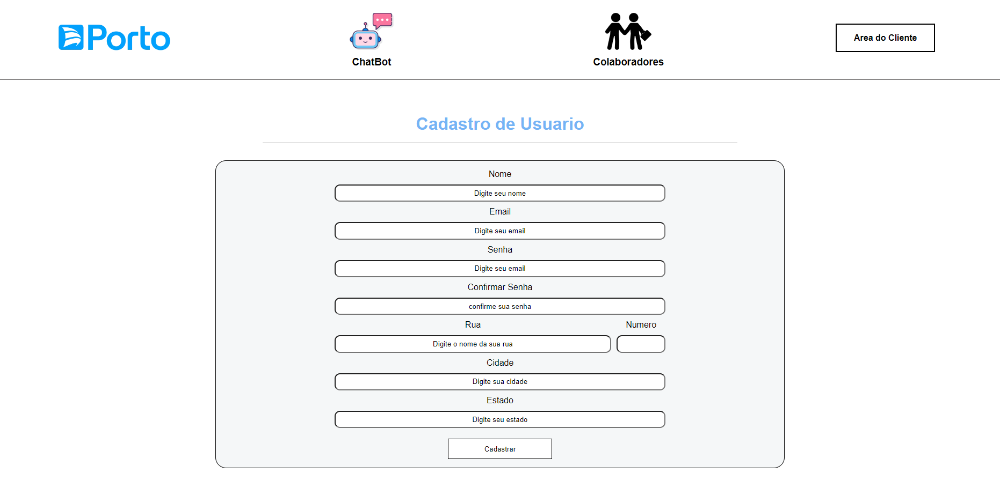
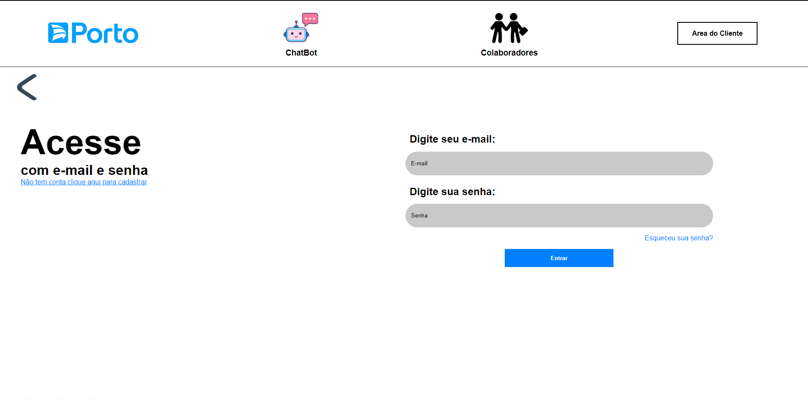
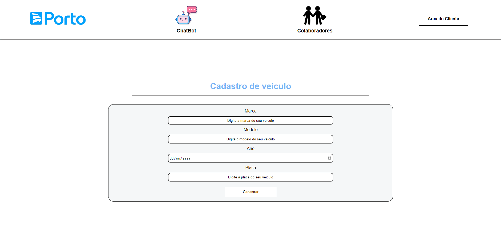
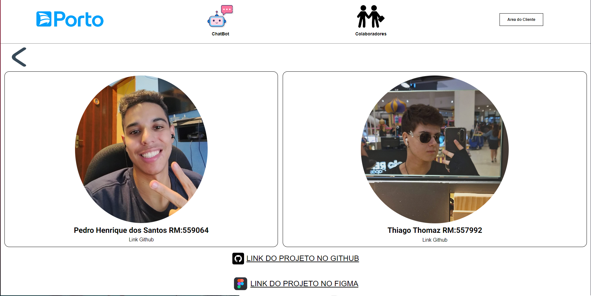

# Iniciar projeto

Para iniciar o projeto devemos abrir o terminal do editor que estiver usando.
Depois de abrir o terminal devemos dar o comando npm install. Para assim baixarmos todas as dependencias necessarias para o projeto rodar.
Apos isso devemos dar o comando npm run dev, através desse comando ira aparecer a o endereço http que o editor abriu para rodar sua aplicação.
Para acessar esse endereço devemos aperta ctrl + o no teclado, ou segura o shift e apertar com o botão esquero no endereço que apareceu no terminal, ou pesquisar esse endereçono google.

# Objetivo do projeto

O objetivo do nosso projeto e desenvolver um software que o usuario podera fazer diagnostico e orçamentos de seu veiculo por meio de uma Inteligencia Artificial sem precisar sair de casa, facilitando assim a manutenção do seus veiculos

# Tecnologias 

Nesse projeto estamos usando
<ul>
  <li>react com typescript para desenvolver o FrontEnd</li>
  <li>Java como backend</li>
  <li>Python para desenvolver a Inteligencia artifial</li>
  <li>Oracle SQL Developer como Banco de Dados</li>
</ul>

# Conteudos

Essa sera nossa pagina principal onde temos um header com os links para as outras paginas e a introdução do nosso projeto
<h2></h2>

Essa pagina sera uma pagina para cadastrar o usuario no sistema
<h2></h2>

Essa pagina sera para o usuario logar na sua conta
<h2></h2>

Essa pagina sera uma pagina para cadastrar um automovel para se fazer o diagnostico e o orçamento
<h2></h2>

Essa pagina será para o usuario conversar com a IA afim de fazer um diagnostico do lado ira aparecer os automoveis cadastrados e um botão para cadastrar outro automovel
<h2></h2>

Essa pagina será para mostrar todos os colaboradores do software e os Links do github deles, o link do github do projeto e o link do projeto no figma
